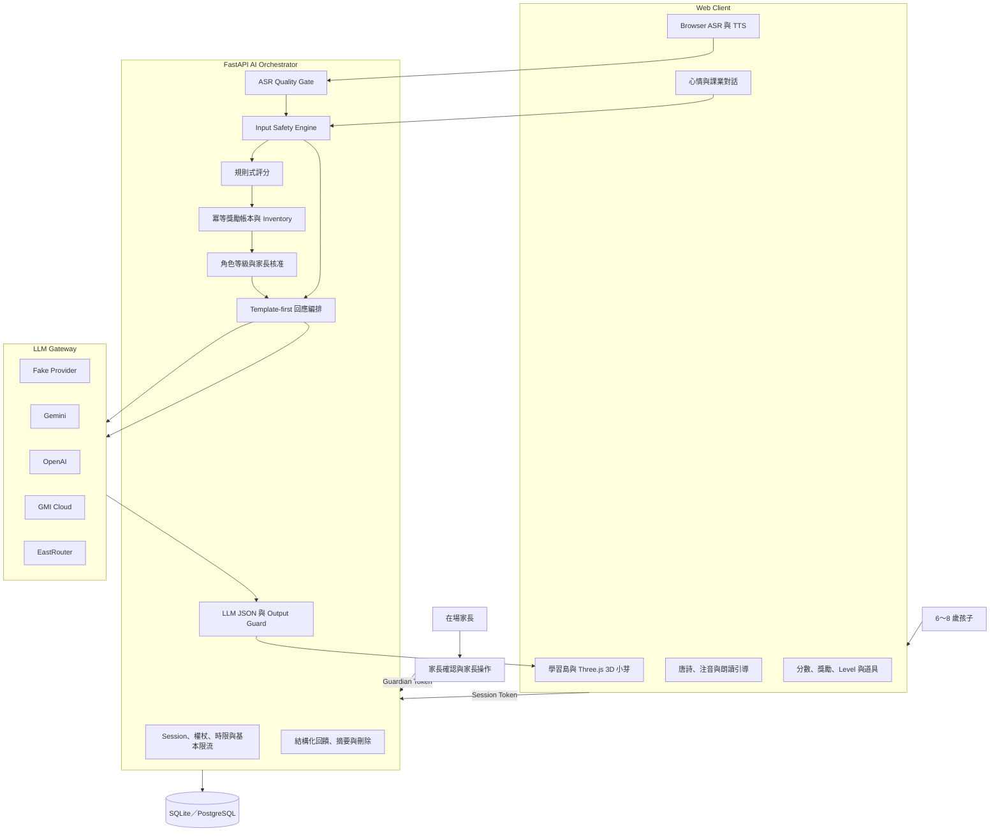

# 小芽 AI 寵物學伴（Xiaoya AI Learning Companion）

> 讓孩子透過「教 AI」建立學習信心，讓 AI 成為陪伴成長、但不取代家長與老師的學習夥伴。

[](LICENSE)
[](https://www.python.org/)
[](https://fastapi.tiangolo.com/)
[](https://threejs.org/)

**線上 Demo：(https://futuremode-hacker-zone.onrender.com/　｜　本機執行請見[快速開始](#安裝與執行)。

> [!IMPORTANT]
> 本專案是研究與展示原型，不是正式教學、醫療或心理諮商服務。未經家長陪同與專業安全審查，不應直接提供給真實兒童使用。詳見 [SECURITY.md](SECURITY.md) 與[限制與未來工作](#限制與未來工作)。

## 問題與目標

大部分兒童學習軟體都在做同一件事：出題、要孩子作答、給分。對 6～8 歲的孩子來說，這代表他一直站在被評量的那一側 —— 答錯累積的是挫折，不是信心。

小芽把這個關係倒過來。**孩子是老師，AI 是學生。**孩子朗讀唐詩「教」小芽念，系統比對瀏覽器產生的逐字稿給出可追溯的分數，而回饋規則是**只加不減**：念得不好照樣拿到完成獎勵，念得好才額外加碼。辨識失敗一律框架成「AI 沒聽清楚」，不是孩子的錯。

小芽也不假裝自己是人。孩子問「你是誰」，它會回答自己是小芽、是 AI、不是真人。遇到情緒或安全議題時，它不接手，而是把孩子交回給身邊的大人。

短期目標是完成可在瀏覽器體驗的虛擬角色與 AI Orchestrator；長期希望發展成具穩定人格、課業引導與情緒陪伴能力的具身 AI 夥伴，在清楚揭露 AI 身分的前提下陪伴孩子成長。

## 核心功能

- **孩子教 AI 的朗讀任務**：選擇公版唐詩，以瀏覽器語音辨識或文字備援提交逐字稿。
- **可追溯的規則式評分**：依正確度、完整度與節奏估計產生分數；只比較文字，不宣稱能診斷發音或學習能力。
- **正向獎勵與成長**：完成、進步與精通可累積金幣、鑽石、道具及里程碑，不因低分倒扣。
- **三級角色能力**：Level 1 只用肢體動作，Level 2 使用安全固定短句，Level 3 經家長核准後才使用受限 LLM 對話。
- **3D 虛擬學習夥伴**：包含學習島、故事森林、小芽房間、角色情緒動作與道具裝飾。
- **台灣口音語音**：小芽的聲音串接 VoAI 絕好聲創，可切換男聲／女聲童聲；服務不可用時自動退回瀏覽器內建語音合成，畫面不會中斷。
- **課業與心情對話**：先經安全分類與本站規則判斷，再決定使用模板或指定 LLM Provider。
- **兒童安全與家長介入**：Session／Guardian 權杖分離、重要情境 Human Bridge、最小化資料保存、家長摘要及資料刪除。
- **多模型 Adapter**：可切換 Fake、Gemini、OpenAI、GMI Cloud 與 EastRouter 相容端點。

## 系統架構



瀏覽器負責畫面、3D 角色、語音辨識與語音合成；FastAPI 後端是唯一能決定評分、獎勵、等級、安全路由及是否呼叫 LLM 的權威來源。LLM 不得自行發獎勵或改變權限，其原始輸出也必須通過格式、長度、安全及關係邊界檢查後才能顯示。

完整模組責任、朗讀流程與資料邊界請見 [系統架構與資料流程](docs/ARCHITECTURE.md)。

## 使用技術

| 類型 | 技術／服務 | 用途 |
| --- | --- | --- |
| AI 模型 | Fake Provider、Gemini API、OpenAI API、GMI Cloud、EastRouter 相容端點 | 本機測試，以及 Level 3 受限對話的可替換模型來源 |
| 前端 | HTML、CSS、JavaScript、Three.js、GLTFLoader | 單頁操作流程、3D 角色、學習地圖與互動動畫 |
| 語音辨識 | Browser Web Speech API | 瀏覽器端逐字稿，不上傳原始音訊 |
| 語音合成 | VoAI 絕好聲創 TTS；瀏覽器 SpeechSynthesis 為備援 | 小芽的台灣口音童聲，金鑰只留在後端 |
| 後端 | Python 3.12、FastAPI、Pydantic | API、AI Orchestrator、安全與回應編排 |
| 資料層 | SQLAlchemy、Alembic、SQLite；保留 PostgreSQL Adapter | 資料模型、交易與資料庫版本遷移 |
| 文字處理 | pypinyin | 教材與介面的繁體中文注音標註 |
| 品質檢查 | pytest、Ruff | 自動測試、程式碼風格與靜態檢查 |
| Sponsor 技術 |OPEN AI |

## 安裝與執行

### 環境需求

- Python 3.12
- [`uv`](https://docs.astral.sh/uv/)
- 最新版 Chrome 或 Edge（繁體中文語音辨識支援較完整）
- 網路連線（前端從 CDN 載入 Three.js）

### 1. 取得專案

```powershell
git clone https://github.com/justinchang9315/futuremode-hacker-zone.git
cd futuremode-hacker-zone
```

### 2. 啟動（一個終端機就夠）

```powershell
cd backend
Copy-Item .env.example .env
uv sync --frozen --dev
uv run alembic upgrade head
uv run uvicorn app.main:app --reload
```

開啟 **<http://127.0.0.1:8000/>** 就能開始玩。

後端會一併提供 `index/` 的前端檔案，所以只需要一個服務、一個網址：

| 路徑 | 內容 |
| --- | --- |
| `/` | 前端 |
| `/v1/...` | API |
| `/docs` | Swagger UI |

`.env.example` 預設 `LLM_PROVIDER=fake`、`TTS_PROVIDER=fake`，所以**初次執行不需要任何
API Key，也不會產生費用**。要接雲端模型或語音時，把真實金鑰只放進 `backend/.env`
（已由 `.gitignore` 排除），設定方式見[後端說明](backend/README.md)。

> [!WARNING]
> 不要把金鑰放進前端、`.env.example`、README、Issue、截圖或 commit。

### 3. 只想單獨跑前端時（可選）

前端是單一 HTML 檔，改完重新整理瀏覽器即可，**不需要重啟後端**。若想用獨立的靜態
伺服器（例如搭配 Live Reload），另開一個終端機：

```powershell
cd index
python -m http.server 5173
```

然後開 `http://127.0.0.1:5173`。這時前端會去呼叫 `http://localhost:8000/v1`，所以後端
仍需啟動，而且埠**必須是 5173 或 3000** —— `backend/.env` 的 `CORS_ORIGINS` 只放行這兩個。
請勿直接雙擊 `index.html`，`file://` 來源會被瀏覽器擋掉。

### 4. 執行測試

```powershell
cd backend
uv run ruff check .
uv run pytest
```

測試使用 Fake Provider，不會呼叫真實模型或消耗 API 額度。

### 專案結構

```text
.
├─ backend/                 FastAPI AI Orchestrator
│  ├─ app/                  API、領域規則、服務與 LLM Adapter
│  ├─ migrations/           Alembic 資料庫遷移
│  ├─ tests/                單元與 API 流程測試
│  ├─ .env.example          可公開的環境變數範本
│  ├─ pyproject.toml
│  └─ uv.lock
├─ index/                   靜態 Web 前端（無建置流程，開瀏覽器即可）
│  ├─ index.html            單一檔案：3D、地圖、朗讀、對話、家長專區
│  ├─ toon_cat.glb          3D 角色（CC BY 4.0，見 ASSETS.md）
│  ├─ ASSETS.md             素材來源與授權紀錄
│  └─ README.md
├─ docs/                    架構與 GitHub 上傳文件
├─ .gitattributes
├─ .gitignore
├─ LICENSE                  MIT（不含第三方 3D 模型）
├─ SECURITY.md
└─ README.md
```

所有 `.env`、本機資料庫、虛擬環境與快取只保留在開發電腦，已由 `.gitignore` 排除。舊版前端與早期 Atlas 實驗已移出儲存庫。

## 作品展示

- 線上作品網址：''https://futuremode-hacker-zone.onrender.com/
- 評選影片：'https://youtu.be/fpTVF_Z-jgo'
- 本機執行：前端 `http://127.0.0.1:5173`、API 文件 `http://127.0.0.1:8000/docs`

## 公開部署

**GitHub 只放程式碼，不會提供執行中的網站。** 這個專案有 FastAPI 後端，GitHub Pages
只能送靜態檔、跑不了 Python，所以需要一個能執行容器或 Python 的平台（Render、Railway、
Fly.io、Cloud Run 皆可）。

部署時**後端會一併提供 `index/` 的前端檔案**，只有一個網域、一組 HTTPS：

| 路徑 | 內容 |
| --- | --- |
| `https://你的網域/` | 前端 |
| `https://你的網域/v1/...` | API |
| `https://你的網域/docs` | Swagger UI |

這樣就沒有 CORS，也沒有「HTTPS 頁面呼叫 HTTP API 被瀏覽器封鎖」的混合內容問題。
前端不需要重新編譯 —— `API_BASE` 會自動判斷：本機開發（5173／3000 埠）指向
`http://localhost:8000/v1`，部署後改用同源相對路徑。

### 平台上必須設定的環境變數

`.env` 已被 `.gitignore` 排除，不會跟著程式碼上去，所以金鑰要在平台的環境變數重設。

| 變數 | 值 | 為什麼 |
| --- | --- | --- |
| `APP_SECRET_KEY` | 長而隨機的字串 | **必填**。`ENVIRONMENT` 是 `production` 時若仍是預設值，後端會拒絕啟動 |
| `ENVIRONMENT` | `production` | 會關閉 `PUT /v1/children/{id}/demo-level`，Demo 控制台的 Lv.1/2/3 切換也會跟著失效 |
| `GEMINI_API_KEY` | 你的金鑰 | Level 3 對話 |
| `VOAI_API_KEY` | 你的金鑰 | 小芽的語音 |
| `TTS_PROVIDER` | `voai` | 不設會退回瀏覽器內建語音 |
| `DATABASE_URL` | 平台的 PostgreSQL 連線字串 | 見下方 |

### 資料庫

預設 `sqlite:///./companion.db` 是容器內的檔案，**多數平台重新部署就會清空**，孩子的
金幣與等級會歸零。要保留紀錄就改用平台提供的 PostgreSQL：

```dotenv
DATABASE_URL=postgresql+psycopg://使用者:密碼@主機:5432/資料庫
```

程式碼不需要改，SQLAlchemy 與 Alembic 會自動套用，`psycopg` 已在依賴中。只是給評審看
的短期 Demo，用預設 SQLite 也可以。

### 部署檔案

- `Dockerfile`：單一映像檔。啟動時先跑 `alembic upgrade head` 再啟動 uvicorn，監聽 `$PORT`。
- `backend/requirements.txt`：由 `uv export` 從 `uv.lock` 產生，給不使用 Docker 的平台。
  改動依賴之後要重新產生：

```powershell
cd backend
uv export --no-dev --format requirements-txt --no-emit-project --no-hashes > requirements.txt
```

### 本機驗證單一服務

不需要另外開前端伺服器：

```powershell
cd backend
uv run uvicorn app.main:app --port 8000
```

然後瀏覽 `http://127.0.0.1:8000/`。前端、3D 模型、API 與 `/docs` 都由這一個服務提供，
和部署後的行為一致。

公開前請一併確認 [`index/ASSETS.md`](index/ASSETS.md) 的 3D 模型授權，以及
[`docs/GITHUB_UPLOAD_CHECKLIST.md`](docs/GITHUB_UPLOAD_CHECKLIST.md)。

## 限制與未來工作

- 瀏覽器 ASR 的支援度、準確度與資料處理方式依瀏覽器及平台而異；目前分數只比較逐字稿，不代表發音診斷。
- 兒童安全規則與危機話術尚未經教育、兒童心理或安全專業人士正式驗證。
- Demo 權杖不是正式家長帳號；公開部署仍需 HTTPS、帳號驗證、Secret Manager、集中式限流、監控與告警。
- 前端的部分 Level 顯示門檻仍需與後端設定同步，後續應改由 API 統一提供。
- 目前從 CDN 載入 Three.js，離線環境需要改成本地打包。
- 語音使用 VoAI 試用金鑰，合成音訊會混入服務商的品牌浮水印；換成正式金鑰即可移除，不需修改程式碼。
- 真實兒童測試前，仍需研究倫理、家長知情同意、兒童適齡同意、隱私法規與資料保存政策。
- 中期將建立角色回饋評測資料、家長／教師評分規準，以及類似 RLHF 的人類回饋迭代流程。
- 後期將設計實體機器人的感測、運動控制與安全停機，並明確切分低延遲／隱私任務的本地端處理，以及高運算量模型的雲端處理。

## 第三方服務、資料與素材

| 項目 | 用途 | 來源 | 授權／資料注意事項 |
| --- | --- | --- | --- |
| OpenAI API | 可選的 Level 3 LLM Provider | [OpenAI API 文件](https://platform.openai.com/docs/) | 外部 API；依 OpenAI 服務條款及資料控制政策使用，不在本儲存庫散布模型權重 |
| Gemini API | 可選的 Level 3 LLM Provider | [Gemini API 文件](https://ai.google.dev/api) | 外部 API；依 Google 服務條款及資料政策使用，不在本儲存庫散布模型權重 |
| GMI Cloud | OpenAI-compatible LLM Provider | [GMI Cloud 文件](https://docs.gmicloud.ai/) | 外部 API；依供應商條款、所選模型授權與資料政策使用 |
| EastRouter | 可選的 OpenAI-compatible Provider | 由使用者自行提供 Base URL 與模型 | Adapter 已實作但預設未設定；啟用前須自行確認該服務的條款、所選模型授權與資料處理方式 |
| Three.js／GLTFLoader | 前端 3D 呈現 | [three.js GitHub](https://github.com/mrdoob/three.js) | MIT License；目前由 Skypack CDN 載入 0.128.0 版 |
| Skypack | Three.js ESM CDN | [Skypack](https://www.skypack.dev/) | 外部 CDN；使用受其服務條款及可用性影響 |
| Web Speech API | 瀏覽器 ASR 與 TTS | [MDN Web Speech API](https://developer.mozilla.org/docs/Web/API/Web_Speech_API) | 瀏覽器功能；部分實作可能將音訊送往瀏覽器供應商服務，需另行揭露與確認 |
| pypinyin | 中文讀音與注音轉換基礎 | [python-pinyin GitHub](https://github.com/mozillazg/python-pinyin) | MIT License |
| VoAI 絕好聲創 | 小芽的台灣口音 TTS | [VoiceAPI 文件](https://connect.voai.ai/doc-vocal/index.html) | 外部 API；金鑰只存在後端 `.env`，前端透過 `POST /v1/tts` 取得音檔。試用金鑰的音訊含品牌浮水印 |
| 公版唐詩 | Demo 朗讀教材 | 李白〈靜夜思〉、王之渙〈登鸛雀樓〉、孟浩然〈春曉〉，見 `backend/app/services/content_seed.py` | 唐代作品原文已進入公有領域；本專案只收錄白話原文，未使用任何現代註解、翻譯或編排 |
| `toon_cat.glb` | 3D 小芽角色 | [Sketchfab：Toon Cat FREE](https://sketchfab.com/3d-models/toon-cat-free-b2bd1ee7858444bda366110a2d960386) | [CC BY 4.0](http://creativecommons.org/licenses/by/4.0/) by Omabuarts Studio；**允許再散布與商用，必須署名**。詳見 [素材授權紀錄](index/ASSETS.md) |

Python 套件版本記錄於 `backend/uv.lock`。API Key、Token、孩童資料、原始音訊、本機資料庫與執行日誌都不得提交到 GitHub。

## 團隊成員

| 姓名 | 分工 |
| --- | --- |
| Justin | 專案規劃／AI Orchestrator／後端／測試 |
| Gerald | ／前端／3D／測試 |
| Jay | AI Orchestrato/後端/ |
| Mick | 後端／測試 |
| Yiling | AI Orchestrator／前端／3D／測試 |
## License

本專案的**原始碼與文件**採用 [MIT License](LICENSE)。

3D 角色模型**不在** MIT 範圍內，需保留原作者署名：

> 3D 角色 "[Toon Cat FREE](https://sketchfab.com/3d-models/toon-cat-free-b2bd1ee7858444bda366110a2d960386)" by [Omabuarts Studio](https://sketchfab.com/omabuarts)，依 [CC BY 4.0](http://creativecommons.org/licenses/by/4.0/) 使用。

這段署名同時出現在應用程式的家長專區與 [`index/ASSETS.md`](index/ASSETS.md)。**散布本專案時必須保留它** —— CC BY 的授權條件就是署名，移除等於失去使用權。

## 延伸文件

- [後端與 API 說明](backend/README.md)
- [前端操作說明](index/README.md)
- [系統架構與資料流程](docs/ARCHITECTURE.md)
- [GitHub 上傳檢查清單](docs/GITHUB_UPLOAD_CHECKLIST.md)
- [安全政策](SECURITY.md)
