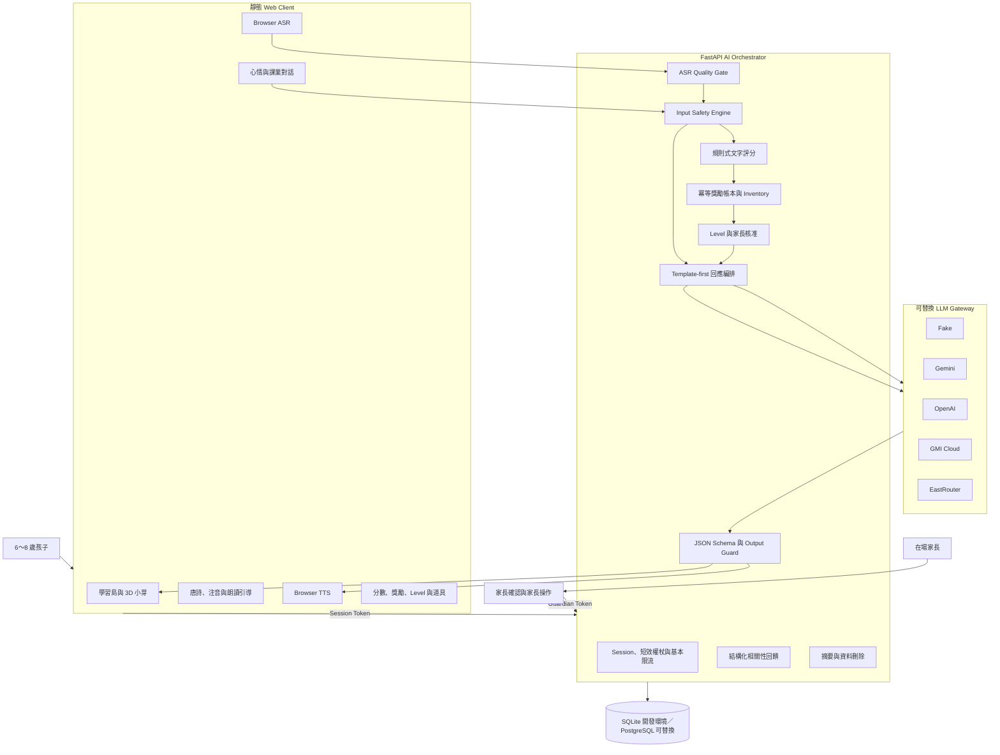
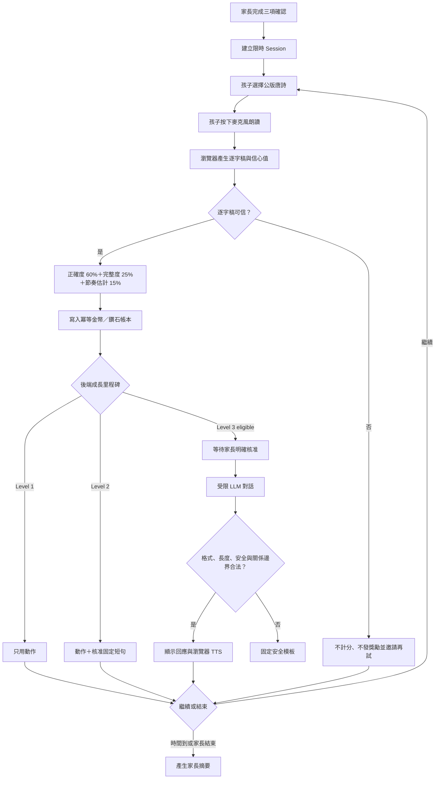

# 小芽 Phase I 系統架構與資料流程

> 狀態：2026-09-05 Web Demo 實作基準。現階段聚焦瀏覽器版虛擬角色；實體機器人與邊緣／雲端部署切分屬後期範圍。

## 設計目標

讓 6～8 歲孩子以「小老師」身分朗讀公版唐詩教小芽，取得透明、可追溯而不宣稱發音診斷能力的文字對照結果。角色能力依完成、進步與精通里程碑解鎖，不使用聊天次數或模擬好感度建立依附。

## 系統架構

## 朗讀與成長流程

## AI Orchestrator 的責任邊界

| 模組 | 主要責任 | 不負責的事情 |
| --- | --- | --- |
| Auth / Session | 家長確認、兩種短效權杖、時限與基本限流 | 正式帳號與真實家長身分驗證 |
| Quality / Scoring | 判斷 ASR 結果能否評分，產生可追溯文字分數 | 發音診斷、智力或學習能力判定 |
| Safety | 危機、個資、操控及不適齡內容的規則式路由 | 取代真人危機服務或專業評估 |
| Rewards / Progression | 獎勵帳本、兌換、里程碑與 Level 3 核准 | 用依附、聊天量或付費刺激升級 |
| Composer / LLM Gateway | 先用規則與模板，必要時才呼叫指定 Provider | 讓 LLM 自行決定獎勵、權限或安全政策 |
| Output Guard | 驗證模型 JSON、長度、問句數及關係邊界 | 保證模型回答永遠正確 |
| Privacy | 最小化事件、家長摘要與刪除 API | 正式資料治理、備份刪除與跨區法遵 |

## 儲存與隱私

- 瀏覽器處理語音辨識及語音合成；後端不保存原始音訊。
- 新朗讀紀錄保存逐字稿 SHA-256 與評分證據，不保存逐字稿原文。
- 一般對話原文不落地；安全事件只保存必要分類、政策版本與固定話術識別碼。
- SQLite 用於本機 Demo；SQLAlchemy 與 Alembic 保留切換 PostgreSQL 的路徑。
- 前端 `sessionStorage` 保存短效權杖，`localStorage` 保存本機 child ID 與裝飾狀態。

## 尚未完成、不可對外宣稱的能力

- 兒童研究倫理審查、家長知情同意文件與兒童適齡同意。
- 由教育、兒童心理或安全專業人士審查危機分類、固定話術和轉介流程。
- 真實兒童繁體中文 ASR Benchmark 與無障礙測試。
- 正式帳號、HTTPS、Secret Manager、集中式 Rate Limit、監控與告警。
- 實體機器人的感測器、運動控制、安全停機，以及本地端／雲端任務切分。
